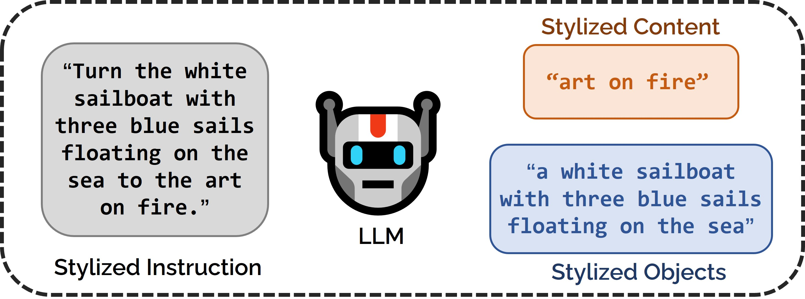
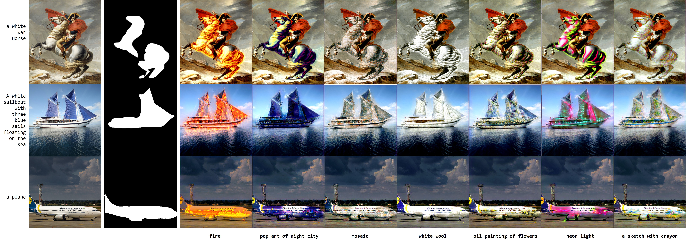

# Soulstyler
Soulstyler: Using Large Language Model to Guide Image Style Transfer for Target Object

[](https://github.com/yisuanwang/Soulstyler)
[](https://colab.research.google.com/drive/1cn4W7IlooDk5X9JXBvsENRtExKJShb98)
[](https://arxiv.org/abs/2311.13562)
---

We provide a demo on colab that can be easily run! [](https://colab.research.google.com/drive/1cn4W7IlooDk5X9JXBvsENRtExKJShb98)

    ⚠: demo in colab needs to download the model from the internet and may run slowly due to GPU limitations (30s-60s an iter, usually need to train about 200 iters to get better results)

For more technical details check out the latest version of the paper on arxiv: [](https://arxiv.org/abs/2311.13562)

❤A more detailed description of the source code is in the process of being organized and will be posted in a readme in this repository when the paper is accepted.

## Framework

Splitting Stylized Instruction into Stylized Content and Stylized Objects using the Large Language Model.



The overall architecture of the system.


## Experiments
The top left is the original image, and the bottom left is the mask generated using the stylized objects via CRIS. The rest are stylized images generated with different stylized content. Our stylized translation results in various text conditions. The stylized images have the spatial structure of the content images with realistic textures corresponding to the text, while retaining the original style of the non-target regions.




<!-- 


 -->

### Selection of Large Language Models
We manually set up 100 Stylized Instruction and corresponding standard answers Stylized Content and Stylized Objects to check the correctness of different LLMs in performing Stylized Instruction comprehension and segmentation.

### Comparison with existing text-guided style transfer models
replacereplacereplacereplacereplacereplace

### Stylized Threshold Experiments: $t \lambda_m L_{\text{mask}}$
replacereplacereplacereplacereplacereplacereplacereplacereplace


## How to Run

### Environment
Python 3.10.13 + 1.12.0+cu116, ubuntu 20.04.1
```
$ conda create -n soulstyler python=3.10
$ conda activate soulstyler
$ pip install -r requirements.txt
$ pip install git+https://github.com/openai/CLIP.git
```

### 1. Single Image Style Transfer
Use this colab->[](https://colab.research.google.com/drive/1cn4W7IlooDk5X9JXBvsENRtExKJShb98)


### 2. Multiple Image Style Transfer
If you think it's long for him to generate a graph (due to the presence of random cropping, this takes a long time to reduce the loss, we'll follow up with optimizations 😳), you can run demo.py, which is a multi-threaded batch-run script that allows for multiple Stylized Content trainings to be performed simultaneously on a single GPU.

Some commands for testing can be found in democases.md (this is just a temporary draft file of commands, a more detailed description of the training, inference detail steps will follow in this github repository)

```
CUDA_VISIBLE_DEVICES=0 python demo.py --case=0 --style=0,7
```

### To Do List
✅1. Colab online running demo

🔘2. Api interface for LLM segmentation methods

🔘3. Video style transfer

🔘4. Faster method of randomized cropping


# Cite
```
@article{chen2023soulstyler,
      title={Soulstyler: Using Large Language Model to Guide Image Style Transfer for Target Object}, 
      author={Junhao Chen and Peng Rong and Jingbo Sun and Chao Li and Xiang Li and Hongwu Lv},
      year={2023},
      eprint={2311.13562},
      archivePrefix={arXiv},
      primaryClass={cs.CV}
}
```

# License
This code and model are available only for non-commercial research purposes as defined in the LICENSE (i.e., MIT LICENSE). 
[Check the LICENSE](./LICENSE)

# Acknowledgment
This implementation is mainly built based on [CRIS](https://github.com/DerrickWang005/CRIS.pytorch), [CLIPstyler](https://github.com/cyclomon/CLIPstyler) and [Llama 2](https://github.com/facebookresearch/llama).