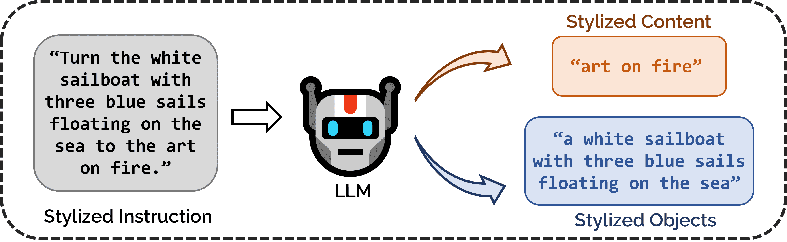
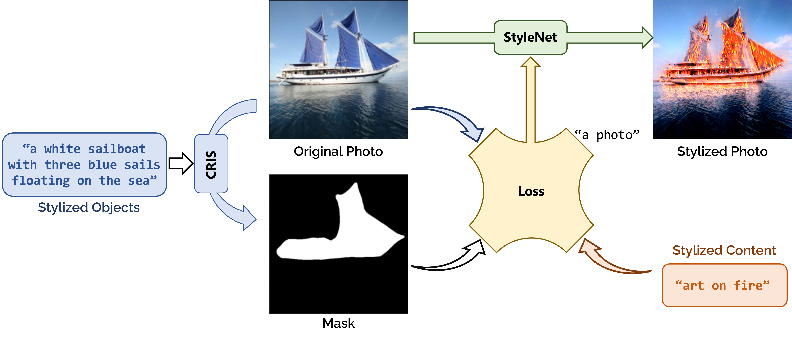

# Soulstyler
Soulstyler: Using Large Language Model to Guide Image Style Transfer for Target Object, Source code and supplementary material.

Our online running demo will be made public soon.

---

## Our method

Splitting Stylized Instruction into Stylized Content and Stylized Objects using the Large Language Model.

The overall architecture of the system.

## Some experimental results
The top left side is the original image and the bottom left side is the mask generated via CRIS using Stylized Objects. The rest are stylized images generated by different Stylized Content. Our style transfer results on various text conditions. Translated images have spatial structure of the content images with realistic textures corresponding to the text.

